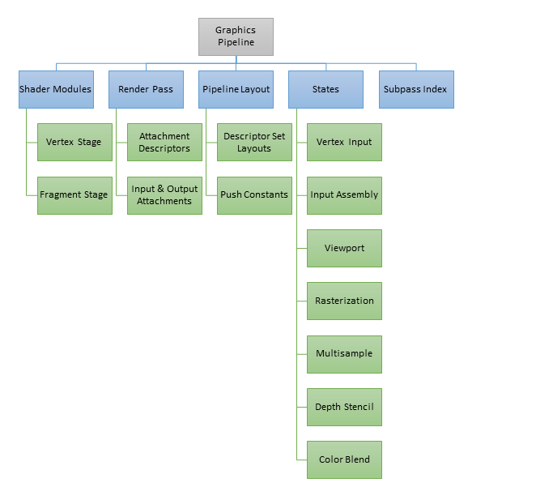
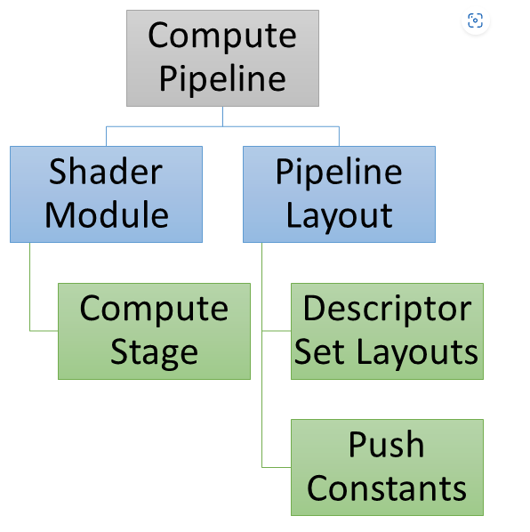
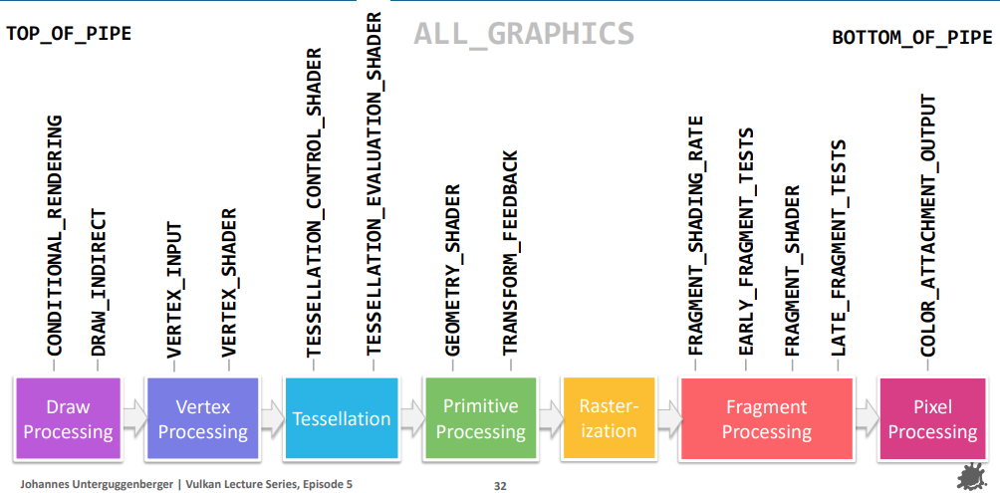
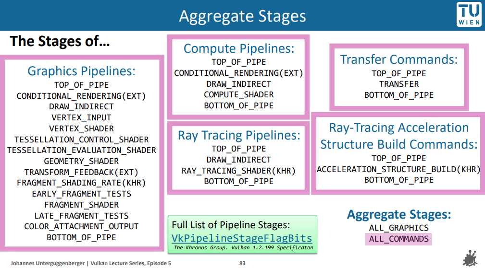

To create a graphics pipeline in Vulkan, the following objects are required:

- VkShaderModule (Vertex and Fragment stages)
- VkRenderPass
- Subpass Index
- VkPipelineLayout
  - Push Constants
  - Descriptor Set Layouts
- Pipeline States
  - Vertex Input
  - Input Assembly
  - Rasterizer
  - Depth Stencil
  - Color Blend

Alternatively for a compute pipeline in Vulkan, you need:

- VkShaderModule (Compute stage)
- VkPipelineLayout
  - Push Constants
  - Descriptor Set Layouts

## Stages

### Pipeline stages and render passes

In render passes there are two “families” of pipeline stages, those which concern themselves with **geometry** processing, and the **fragment** family, which does rasterization / frame buffer operations.

###### Geometry

- DRAW_INDIRECT – Parses indirect buffers
- VERTEX_INPUT – Consumes fixed function VBOs and IBOs
- VERTEX_SHADER – Actual vertex shader
- TESSELLATION_CONTROL_SHADER
- TESSELLATION_EVALUATION_SHADER
- GEOMETRY_SHADER

###### Fragment

- EARLY_FRAGMENT_TESTS
  - This is the stage where early depth/stencil tests happen
  - This is also where a render pass performs its **loadOp of a depth/stencil attachment.**
- FRAGMENT_SHADER
- LATE_FRAGMENT_TESTS
  - This is where late depth-stencil tests take place, and also where **depth-stencil attachments are stored** with **storeOp** when a render pass is done.
- COLOR_ATTACHMENT_OUTPUT
  - This one is where loadOp, storeOp, MSAA resolves and frame buffer blend stage takes place, basically **anything which touches a color attachment in a render pass** in some way
  -  If you’re waiting for a render pass which uses color to be complete, use srcStageMask = COLOR_ATTACHMENT_OUTPUT, and similar for dstStageMask when blocking render passes from execution.

## Graphics Pipeline Library Overview

### Vertex Input Interface

The Vertex Input Interface contains the information that would normally be provided to the full pipeline state object by `VkPipelineVertexInputStateCreateInfo` and `VkPipelineInputAssemblyStateCreateInfo`

### Pre-Rasterization Shaders

The Pre-Rasterization Shaders contain the vertex, tessellation, and geometry shader stages along with the state associated with [VkPipelineViewportStateCreateInfo](https://www.khronos.org/registry/vulkan/specs/1.2-extensions/man/html/VkPipelineViewportStateCreateInfo.html), [VkPipelineRasterizationStateCreateInfo](https://www.khronos.org/registry/vulkan/specs/1.2-extensions/man/html/VkPipelineRasterizationStateCreateInfo.html), [VkPipelineTessellationStateCreateInfo](https://www.khronos.org/registry/vulkan/specs/1.2-extensions/man/html/VkPipelineTessellationStateCreateInfo.html), and [VkRenderPass](https://www.khronos.org/registry/vulkan/specs/1.2-extensions/man/html/VkRenderPass.html) (or dynamic rendering).

This may sound like more information than your engine would know at shader creation time. However, the key is that by combining pipeline libraries with dynamic state extensions, the only information you actually need to create the pre-rasterization shader is the SPIR-V code and pipeline layout.

### Fragment Shader

The fragment shader stage contains the fragment shader along with the state in `VkPipelineDepthStencilStateCreateInfo` and `VkRenderPass` (or dynamic rendering - although in that case only the viewMask is required).

### Fragment Output Interface

 There is the Fragment Output Interface, which contains the `VkPipelineColorBlendStateCreateInfo`, `VkPipelineMultisampleStateCreateInfo`, and `VkRenderPass` (or dynamic rendering).

Like with the Vertex Input Interface, this stage requires information that we don’t know until draw time, so this state is also hashed and the Fragment Output Interface pipeline is created at draw time

So for graphics pipeline libraries, the way we create our pipeline layouts is as follows:

- Descriptor Set 0 - an “uber set” that contains all possible consumed dynamically bound resources that can be shared across the VS/FS
- Descriptor Set 1 - only provided to pre-rasterization library (vertex shader) if used
- Descriptor Set 2 - only provided to fragment shader library if used
- Descriptor Set 3 - provided to both stages if used

## Read Later

### VK_EXT_graphics_pipeline_library

[Khronos Blog - The Khronos Group Inc](https://www.khronos.org/blog/reducing-draw-time-hitching-with-vk-ext-graphics-pipeline-library)

