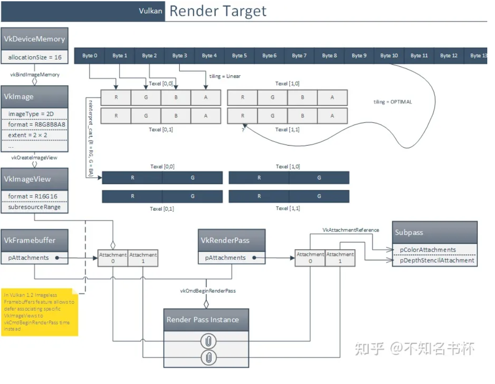

RenderPass或准确的说**一个subpass对应了一套图形管线状态下的一次渲染**。Pipeline的作用就是描述一套pass流程中流程的所有状态. RenderPass本质是**定义一个完整的渲染流程**以及使用的**所有资源**的描述，可以理解为是一份元数据或者占位符的概念其中不包含任何真正的数据。

RenderPass的资源可能包括 Color、Depth/Stencil、Resolve Attachment和Input Attachment(潜在地在同一RenderPass的上一个SubPass中产出的同样属于RenderPass的资源)，而这些**资源被称为Attachment**.

为什么不直接把它们叫做RenderTarget呢？因为**Attachment只是资源描述**(元数据)定义一些加载/存储操作以及相应资源的格式。RenderPass其实是通过**Framebuffer中包含的ImageView拿到真正的数据**(牢记RenderPass只是元数据)。并且之后的RenderPass中只要满足Vulkan定义的Render Pass Compatibility要求的Framebuffer，Framebuffer就能通过RenderPass渲染出相应的结果。

- [Vulkan® Renderpasses - AMD GPUOpen](https://gpuopen.com/learn/vulkan-renderpasses/)

  - for tile based gpu

     Tiling GPU drivers can use this information to determine when to bring data on and off chip, whether or not to flush data out to memory or discard the content of tile buffers and even to do things like size memory allocations used for binning and other internal operations

  - NOT Tiled GPU

    In Vulkan, a renderpass object **contains the structure of the frame**. In its simplest form, a renderpass encapsulates **the set of framebuffer attachments**, **basic information about pipeline state** and not much more. However, a renderpass can contain one or more subpasses and information about how those subpasses relate to one another. This is where things get interesting.

### Subpass

- Each subpass can reference a subset of the framebuffer attachments for writing and also a subset of the framebuffer attachments for reading. These readable framebuffer attachments are known as ***input attachments*** ( *input attachments guarantee that each fragment shader only accesses data produced by shader invocations at the same pixel* ) and effectively contain the result of an earlier subpass at the same pixel. 

- each subpass contains information about what to do with each of the attachments when it begins (clear it, restore it from memory, or leave it uninitialized) and what to do with the attachments when it ends (store it back to memory or throw it away).

  

## Go Forward Faster

As it turns out, a forward renderer such as ours can take advantage of this kind of information as well. Here are a few examples of the types of optimizations we can make.

J**ust as we can tell that one subpass depends on the result of an earlier one, we can tell when a subpass *does not* depend on an earlier one**. Therefore, we can sometimes render those subpasses in parallel or even out of order without synchronization. If one subpass depends on the result of a previous subpass, then with a traditional graphics API, the driver would need to inject a bubble into the GPU pipeline in order to synchronize the render backends’ output caches with the texture units’ input caches. However, by rescheduling work, we can instruct the render backends to flush their caches, process unrelated work and then invalidate the texture caches before initiating the consuming subpass. This eliminates the bubble and saves GPU time.

Because each subpass includes information about **what to do with its attachments**, we can tell that an application is going to clear an attachment, or that it doesn’t care about the content of that attachment. This allows the driver to schedule clears far ahead of real rendering work, or to intelligently decide what method to use to clear an attachment (such as using a compute shader, fixed function hardware or a DMA engine). If an application says that it doesn’t need an attachment to have defined data, we can bring the attachment into a partially compressed state. This is where the data it contains is undefined but its state, as far as the hardware is concerned is optimal for rendering.

In some cases, the **in-memory layout** of data is different for optimal rendering and reading via the texture units. By analyzing the data dependencies that an application provides, our drivers can decide when it is best to perform layout changes, decompression, format conversion and so on. It can also split some of these operations into phases, interleaving them with application-supplied rendering work, which again, eliminates pipeline bubbles and improves efficiency.

Finally, Vulkan includes the concept of **transient attachments**. These are framebuffer attachments that begin in an uninitialized or cleared state at the beginning of a renderpass, are written by one or more subpasses, consumed by one or more subpasses and are ultimately discarded at the end of the renderpass. In this scenario, the data in the attachments only lives within the renderpass and never needs to be written to main memory. Although we’ll still allocate memory for such an attachment, the data may never leave the GPU, instead only ever living in cache. This saves bandwidth, reduces latency and improves power efficiency.

## FrameBuffer

RenderPass需要与Framebuffer获取到真正的Image才可以渲染出真正的结果。Framebuffer代表了RenderPass所使用的特定内存的集合，也就是Attachment真正对应的内存。已经了解到RenderPass只是元数据，真正的Image需要从Framebuffer中获取。Framebuffer会定义了哪个ImageView是对应到RenderPass的哪个Attachment。ImageView定义了要使用Image的哪一部分。Image定义了哪个物理内存被使用以及Texel的格式。整体的流程如下图所示：

