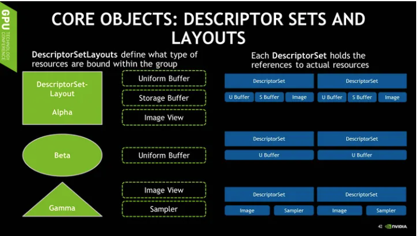

### 概念

- RenderPass或准确的说**一个subpass对应了一套图形管线状态下的一次渲染**。Pipeline的作用就是描述一套pass流程中流程的所有状态

### 传统API局限

循环的最外层，通常每一帧都会有好几个render pass，例如shadow map和gbuffer的渲染，光照以及各种后处理等。每个pass都有需要设定特定的管线状态，例如blending，depth，raster的状态等等。在下面几层循环中通畅需要遍历所有的shader和着色系统需要的材质参数，如纹理，常量等等。在最内层的循环中，则是需要遍历共享材质的几何体，在这里同场需要绑定vertex buffer和index buffer，以及针对物体的常量参数例如矩阵等

- 每一帧大量的状态更新，资源绑定操作所花费的计算时间就不能被简单的忽略

- 修改管线状态的操作时，驱动会在后台运行许多工作，包括下载纹理，Mipmap Downsample，资源访问的同步，渲染状态组合正确性验证，以及错误检查等等等等。对于3D App开发者来说，这些工作什么时候发生，是否发生，都是在API层面无法确定的。所以这样的结果就是在CPU端造成卡顿

- 传统图形API的另一个问题就是，并不多线程友好

  > 无论OpenGL还是Direct3D，都包含一个***Context***的概念。Context包括当前渲染管线中的所有状态，绑定的Shader，Render Target等。在OpenGL中Context和单一线程是绑定的，所以所有需要作用于Context的操作，例如改变渲染状态，绑定Shader，调用Draw Call，都只能在单一线程上进行

### Vulkan的设计哲学及架构

- **更依赖于程序自身的认知**，让程序有更多的权限和责任自主的处理调度和优化，而不依赖于驱动尝试在后台的优化。程序开发者应该程序的最优化行为最为了解，传统图形API则靠驱动分析程序中调用API模式来揣测并且推断所有操作的优化方法。

- **多线程友好。**

  > 让程序尽可能的利用所有CPU计算资源从而提高性能。***Vulkan中不再需要依赖于绑定在某个线程上的Context，而是用全新的基于Queue的方式向GPU递交任务***，并且提供多种Synchronization的组件让多线程编程更加亲民。

- **强调复用**，从而减少开销。

  > 大多数Vulkan API的组件都可以高效的被复用。

##### Device

> Device很好理解，一个Device就代表着一个你系统中的物理GPU。它的功能除了让你可以选择用来渲染（或者计算）的GPU以外，主要功能就是为你提供其他GPU上的资源，例如所有要用到显存的资源，以及接下来会提到的Queue和Synchronization等组件。

##### Pipeline

> 一个Pipeline包含了传统API中大部分的状态和设定。只不过Pipeline是需要事先创建好的，这样所有的状态组合的验证和编译都可以在初始化的时候完成，运行时不会再因为这些操作有任何性能上的浪费,**一个Pipeline应该是可以通过绑定不同的资源而复用的**

**接下来介绍的几个组件就可以被动态的绑定给任何Pipeline。**

##### Buffer

在Vulkan中需要特别注意Buffer是从什么类型的内存中分配的，有的类型CPU可以访问，有的则不行。有的类型会在CPU上被缓存。现在这些内存的类型是重要的功能属性

##### Image

> Image也需要在创建的时候指定使用它的模式，例如Vulkan里有参数指定Image的内存Layout，可以是Linear，也可以是Tiled Linear便于纹理Filter. **类似传统的API，纹理本身并不直接绑定给Pipeline。需要读取和使用Image则要依赖于ImageView。**

##### 内存

##### Descriptor（绑定规则）

上面提到，Buffer和Image可以动态的绑定给任意Pipeline。**而具体绑定的规则就是由Descriptor指定。**

和其他组件一样，Descriptor Set也需要在被创建的时候，就由App指定它的固定的Layout，以减少渲染时候的计算量。**Descriptor Set Layout**可以指定绑定在指定Descriptor Set上的所有资源的种类和数量，以及在Shader中访问它们的索引。

> App可以定义多个不同的Descriptor Set Layout，也可以拥有多个指定Layout的Descriptor Set。因为Descriptor Set是预先创建并且无法更改的，所以**改变一个绑定的资源需要重新创建整个Descriptor Set**，但**改变一个资源的Offset可以非常快速的在绑定Descriptor Set的时候完成**。一会我会讨论如何利用这一点来实现高效的资源更新。

##### Command Buffer

那么Command Buffer就是渲染本身所需要的行为。在Vulkan里，没有任何API允许你直接的，立即的像GPU发出任何命令。所有的命令，包括渲染的Draw Call，计算的调用，甚至内存的操作例如资源的拷贝，都需要通过App自己创建的Command Buffer。

> **另一个值得注意的是，为了让驱动能更加简易的优化这些Command的调用，没有任何渲染状态会在Command Buffer之间继承下来。每一个Command Buffer都需要显式的绑定它所需要的所有渲染状态，Shader，和Descriptor Set等等**

##### Queue

Queue，是Vulkan中唯一**给GPU递交任务的渠道**。Vulkan将Queue设计成了完全透明的对象，所以在驱动里没有任何其他的隐藏Queue，也不会有任何的Synchronization发生

Queue的API极其简单，你向它递交任务（Command Buffer），然后如果有需要的话，你可以等待当前Queue中的任务完成。这些Synchronization操作是由Vulkan提供的各种同步组件完成的。例如**Samaphore**可以让你同步Queue内部的任务，程序无法干预。**Fence**和**Event**则可以让程序知道某个Queue中指定的任务已经完成。

Queue不光接收图形渲染的调用，也接受计算调用和内存操作。

### Vulkan编程模式

传统API中，内存的分配，资源的创建以及资源的使用都是一对一的映射，很明显这不是最佳的资源管理模式。在Vulkan中，一次来自Heap的资源分配可以同时创建多个Buffer，每个Buffer又可以用于不同的格式以及用途。这样相对传统的情况已经有不少的优化。Vulkan甚至允许讲一个Buffer对象的不同子区间划分给格式以及用途不同的子Buffer，例如**索引和顶点Buffer可以共享同一个Buffer**，**只要在绑定的时候指定不同的偏移量即可**。这也是最优的做法，它既减少了内存分配的频率，也减少了Buffer绑定的频率。

正是因为Vulkan在**Descriptor Set中绑定资源的时候，不仅需要指定Buffer，也需要指定Buffer的中资源的偏移量，所以我们可以利用这个特性达到高效的更新以及绑定的资源**。因为我们可以同时绑定多个不同的资源到同一个大Buffer的不同子区间，然后在需要绑定不同的资源的时候可以重复使用同一个Descriptor Set，指定不同的偏移量即可。

#### 多线程渲染

##### 方式1

一种是在CPU端并行的更新一些Buffer中的数据。这里要注意的是，多线程的情况下更新资源要保证安全。如果你的程序渲染的非常高效，通常在CPU端会同时有好几帧的数据要处理。所以程序会可以Round Robin的方法更新并且使用这些资源。这个时候要是别的线程写的前面某一帧还没有被读取完的数据则会造成错误。Vulkan的Event可以被插入在Command Buffer中，在使用指定资源的调用后面。这样App回一直等到SetEvent被调用之后才会更新指定的资源。

当然在最理想的情况，程序不用真正的等这些Event，因为它早已经被Set过了。当然具体情况要取决于整个系统的性能，以及你的Round robin环有多长。

##### 方式2

并行的在**不同线程**上生成场景不同部分的渲染任务，并且**生成自己的Command Buffer**，不用任何线程间的Synchronization。最后，**不同的线程可以将Command Buffer的Handle传给主线程然后由主线程将它们写入Queue中**，也可以直接写入子线程中的per-thread Queue递交给GPU。不过Queue的任务递交时间并不是完全可以忽略的，所以这里还是建议将Command传给主线程一起递交

Command Buffer的更新需要注意不能直接复盖还未被使用的Command Buffer。Vulkan的Queue写入API接收一个Fence参数，这个Fence会在这个Queue中的任务都被GPU处理完毕后会被Signal。所以程序将Command Buffer递交给Queue后，可以马上接着并行的更新和递交新的任务。直到Fence之前的Fence被Signal之后，才可以安全的覆盖那个Fence所对应Queue中的Command Buffer。

另一个需要主意的多线程相关的组件是Command Buffer Pool。Command Buffer Pool是Command Buffer的父亲组件，负责分配Command Buffer。Command Buffer相关的操作会对其对应的Command Buffer Pool里造成一定的工作，例如内存分配和释放等等。因为多个线程会并行的进行Command Buffer相关的操作，这个时候如果所有的Command Buffer都来自同一个Command Buffer Pool的话，这时Command Buffer Pool内的操作一定要在线程间被同步。所以这里**建议每个线程都有自己的Command Buffer Pool**，这样每个线程才可以任意的做任何Command Buffer相关的操作。

Command Buffer Pool的另一个性质就是支持**非常高效的重置**。一旦重置，所有由当前Pool分配的Command Buffer都会被清零，并且不会有任何内存管理上的碎片。所以程序只要为每一个帧和线程的组合分配一个Command Buffer Pool，就可以利用这一点，在更新Round Robin中的Command Buffer时非常快速的将需要的Buffer清零。

另一个类似Command Buffer Pool的组件，就是Descriptor Pool。所有Descriptor Set都由Descriptor Pool分配，Descriptor Set操作会导致对应的Descriptor Pool工作而且需要线程间同步，并且Descriptor Pool也支持非常高效的将所有由当前Pool分配的Descriptor Set一次性清零。所以程序应该为**每个线程分配一个Descriptor Pool，**可以根据Descriptor Set的更新频率，创建不同的Descriptor Pool，例如每帧、每场景等等。