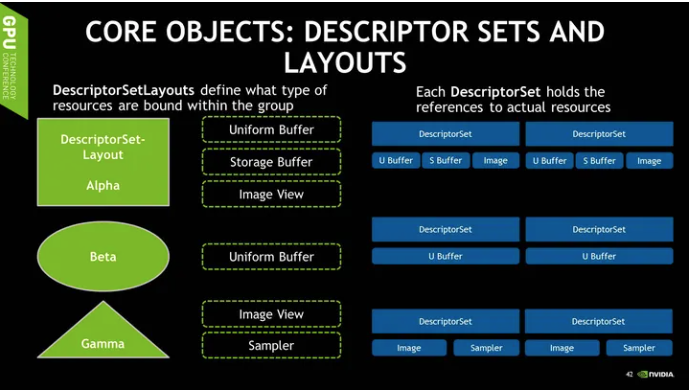
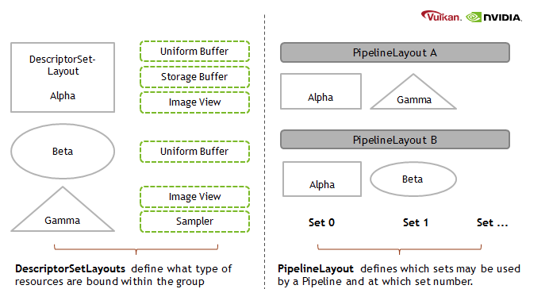
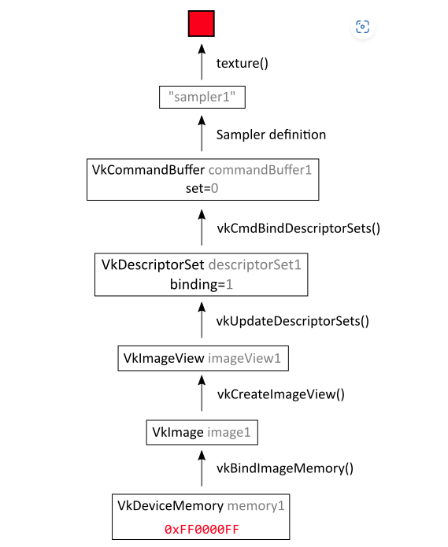
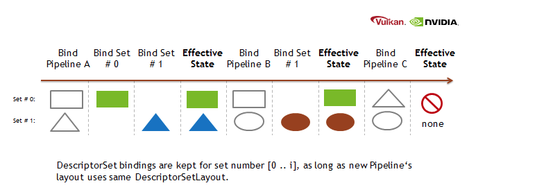

### Descriptor

其实也就是认为Descriptor为一个句柄(Handle)或者一个指向资源的指针。





- **DescriptorSetLayout**: This object describes **which bindings are in the DescriptorSet for every shader stage**. For example, we define at binding 0 a constant buffer used by both vertex and fragment stages, at binding 1 a storage buffer and at 2 an image only for fragment stage. It is the developer’s responsibility to ensure the shaders (SPIR-V) have compatible definitions for the DescriptorSet.

- **PipelineLayout**: As a pipeline (shader and most important rendering state) can have multiple DescriptorSets, this object defines **which DescriptorSetLayouts are used with each set binding number.** Using the same DescriptorSetLayouts at the same units across pipelines, has some performance benefits, more about that later.

  

  This [website][Long way to access data] 

> 建立pipelineLayout的时候就决定了shader中
>
> ```glsl
> layout(set==xx, binding=xx）
> ```
>
> xx的值，并且这个值还要和 
>
> ```c++
> vkCmdBindDescriptorSets() // 可以按照顺序绑定许多个sets
> ```
>
> 的时候相一致
>
> ```
> 
> ```



[Long way to access data]: https://www.asawicki.info/news_1707_vulkan_long_way_to_access_data

### Optimized Bindings Across Pipelines



The above illustration shows that bound DescriptorSets stay active as long as the PipelineLayout for that binding slot is matching.

[Vulkan Shader Resource Binding | NVIDIA Developer](https://developer.nvidia.com/vulkan-shader-resource-binding)