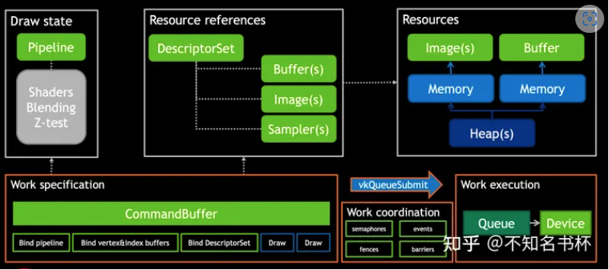
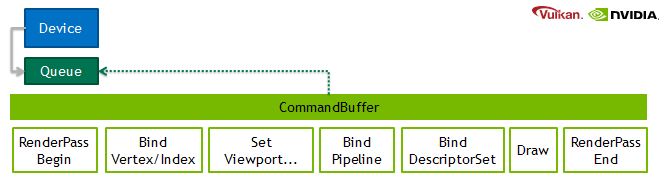
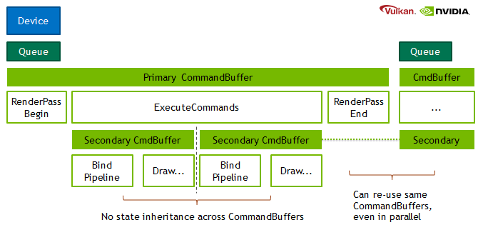
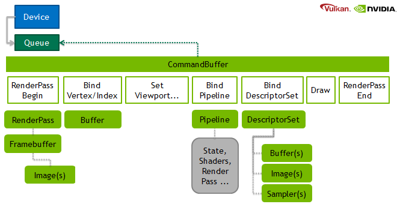
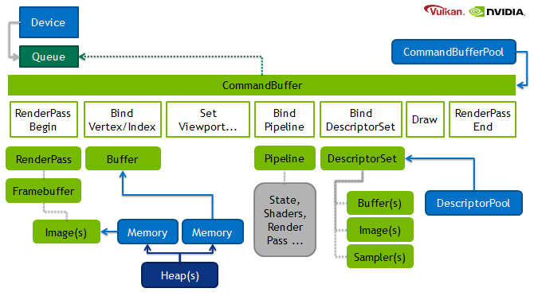

[Engaging the Voyage to Vulkan | NVIDIA Developer](https://developer.nvidia.com/engaging-voyage-vulkan#)

### Command Buffer

Vulkan通过Command Buffer完成Record Command的操作。这些Commnad之后会通过Command Buffer被提交到Queue再被提交到GPU中执行。

需要被Record的Command包括

- 将Pipeline和DescriptorSet绑定到Command Buffer的命令、

- 修改Dynamic State、

- 以及DrawCall相关的Command(用于图形渲染),Dispatch的命令(用于计算)、

- 执行Secondary Command Buffer的(仅用于Primary Command Buffer)、

- 复制Buffer和Image的Command以及其他VkCmdXXXX所有的调用

  如下图所示。

### Submit Command

物理设备中Queue可能不止一个，每一个Queue都被包含在Queue Families中。Queue Families是一个有相同功能的Queue的集合，但是一个物理设备中可以存在多个Queue Families，不同的Queue Families有不同的特性。相同Queue Families中的Queues所有功能都相同并且可以并行运行，但是会有一个优先级的问题，这个需要慎重考虑(优先级较低的Queue可能会等待很长时间都不会处理)

在这里大部分的情况都只需要一个Queue就可以满足需求，Queue基本上是 "提交工作 "和 "等待空闲”的状态。一般来说**Command Buffer就会被提交到Queue。Queue再将Command提交到GPU中去执行。**

## Command Submission

In this post we want to look at the basic operations that normally happen in a rendering frame and which API mechanisms are used. Let’s look at doing a draw-call in Vulkan.

Where OpenGL’s state and drawing commands are often immediate, for Vulkan most of these operations are deferred. The **CommandBuffer** hosts the typical set of commands to setup rendering state and is then submitted to the **Queue** for execution.

The actual operations within the CommandBuffer should not sound too unfamiliar. A RenderPass is similar to framebuffer-object binding, and a DescriptorSet handles uniform bindings (buffer, texture…), more about those later.

- **Device**: The device is used to query information, and to create most of Vulkan’s API objects.
- **Queue**: A device can expose multiple queues. For example, there can be dedicated queue to copying data, or the compute and/or graphics queue. Operations on a single queue are typically processed in-order, but multiple queues can overlap in parallel.
- **CommandBuffer**: Here we record the general commands such as setting state, executing work like drawing from vertex-buffers, dispatching compute grids, copying between buffers… function wise nothing fundamentally different. While there are still costs for building, the submission to the queue will be rather quick.

## Command Buffer Usage

We can build and submit multiple CommandBuffers in parallel, and re-use them. Re-use is particularly useful in scenarios that were traditionally CPU heavy. Imagine re-submitting a scene for multiple shadow-maps, or left and right eye for VirtualReality glasses, or submitting multiple complex objects, or entire scenes for several frames at very low CPU cost. The Vulkan driver doesn’t need to do guessing or use heuristics about their usage, as the developer provides the information at creation time up-front. The following illustration shows that Vulkan distinguishes between primary and secondary CommandBuffers.

- **Primary CommandBuffer** always handles RenderPass setup. All the other typical rendering operations can be either directly recorded, or provided by secondary CommandBuffer.
- **Secondary CommandBuffer** can encode a subset of commands.

It is important to note that in core Vulkan there is generally no state-inheritance between CommandBuffers. The only inheritance is that a secondary CommandBuffer does use the active images that are being rendered into, as defined by the primary CommandBuffer.

## Common Objects for Rendering

What makes CommandBuffer recording fast? A key aspect of Vulkan is to use more objects with pre-validated state and references those in the CommandBuffers. Therefore, it overcomes some deficits of unextended OpenGL. While OpenGL’s multi-draw-indirect buffer is re-usable and fillable in parallel as well, it doesn’t allow state changes (NV_command_list does to a degree). Going back even further display-lists just allowed way too many changes which resulted in only a subset being implementable fast. Display-lists also stored the data immutable along with them, while the modern way is to reference data. This means a scene represented by a CommandBuffer can still be fully animated, as the referenced data such as matrices or vertices reside in buffers whose contents can be changed independently.

The next image shows what objects are used for the various commands.

- **Image**: Represents formatted data organized in regular grids used in texturing, render-targets… Equivalent of an OpenGL texture.
- **FrameBuffer**: A set of Image attachments that are being rendered into. It must match the configuration of the RenderPass it is used with.
- **RenderPass**: In principle encodes the format of the framebuffer attachments, what type of clears, whether we do multi-pass effects, pass dependencies… This is one of the bigger new features that Vulkan has to offer which will be subject of a later blog post.
- **Buffer**: Represents raw linear memory used for vertex, index, uniform data… Equivalent to an OpenGL buffer.
- **Pipeline**: Encodes rendering state such as shaders being used, depth-testing, blending operations… All captured into a single monolithic object. Because all important state is provided upfront at the creation time of the object, its later usage can be very quick. OpenGL’s internal validation may have to do state-dependent compilation of shaders that at worst could create stuttering at draw-time. With Vulkan you have precise control over when such validation is triggered.
- **DescriptorSet**: A set of bindings for shader inputs. Instead of binding resources individually in OpenGL, Vulkan organizes them in groups. You can re-use such a binding group as well. In a later blog post we will cover the various ways how to provide uniform data to your compute or draw calls.

## Allocation Management

There is a new level of complexity to Vulkan, that didn’t really exist in OpenGL before. We will only briefly touch on the topic of allocation management here. In Vulkan various API objects are generated from other resources, as hinted in the image below.

- **CommandBufferPool**: The CommandBuffers and their content are allocated from these pools.
- **DescriptorPool**: Many DescriptorSets can be allocated from a single pool.
- **Heap**: The device comes with fixed amount of limited heaps, which memory is allocated from.
- **Memory**: Buffers and Images are bound to Memory depending on their requirements and the developers preference. This allows manual sub-allocation of resources from a bigger block of memory or aliasing the memory with different resources.

The pools simplify deletion of many resources that were allocated from them at once and they also ensure allocations can be done lock-free by using per-thread pools. For example one can use a different CommandBufferPool per-frame and create all temporary CommandBuffers from it. After a few frames when all these CommandBuffers have been completed by the GPU, the pool can be reset and new temporaries generated from it.

Memory management also allows for greater control and new use-cases such as aliasing memory. A memory allocation is rather costly and some operating systems also have fixed overhead for how many allocations are active at once. We therefore encourage developers to sub-allocate resources from larger chunks of memory.

## Command

所有Command的功能可以分为：

- Perform Actions
- Set State
- Perform Synchronizations

| Action            | Set State                      | Synchronization         |
| ----------------- | ------------------------------ | ----------------------- |
| Draw              | Bind Pipeline                  | Set/Wait Events         |
| Dispatch          | Bind Descriptor Sets           | Pipeline Barrier        |
| Clear             | Bind Buffers                   | Render Pass Dependencis |
| Copy              | Set Dynamic State              | Sub Pass Dependencis    |
| Query/Timestamp   | *Push Constants                |                         |
| Begin/End Subpass | Set Render Pass/Sub Pass State |                         |

Action Command会经历多个 pipeline state。

会执行的哪些Pipeline Stage取决于所使用的特定Command以及Record Command时的当前Command Buffer状态。而且针对不同的Command还会有这一些特定的Pipeline Stage，有些同步Command会包含Pipeline Stage参数将该Command的同步范围限制在这些Pipeline Stage内