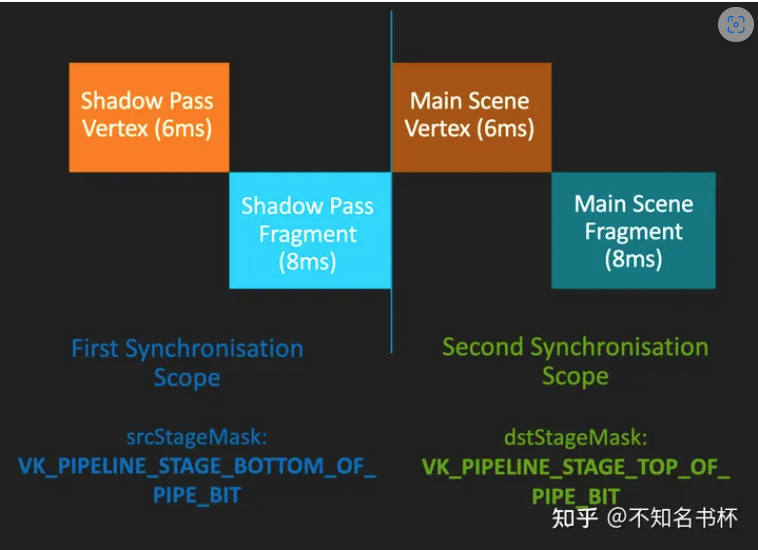
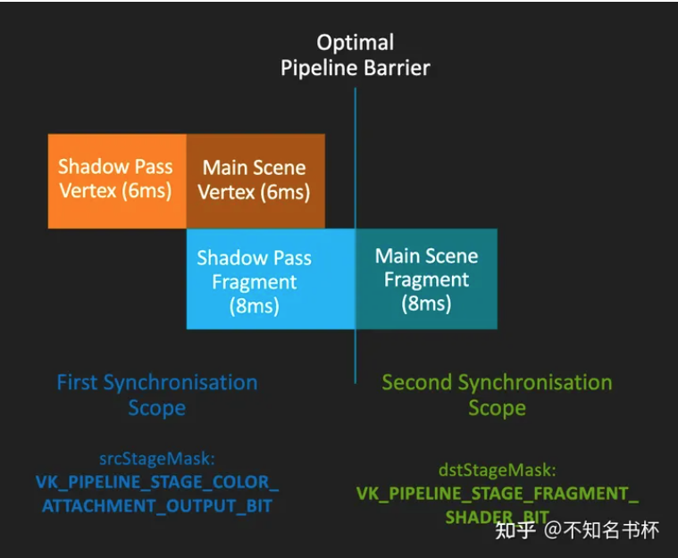

## All I need is here [Yet another blog explaining Vulkan synchronization – Maister's Graphics Adventures (themaister.net)](https://themaister.net/blog/2019/08/14/yet-another-blog-explaining-vulkan-synchronization/)


## 总结

#### 1. The Vulkan queue （ single VkQueue）

- **Misconceptions**

  Any synchronization applies globally to a VkQueue, there is no concept of a only-inside-this-command-buffer synchronization.

- ~~**Command Overlap**~~

  ~~Unless you add synchronization yourself, all commands in a queue execute out of order. Reordering may happen across command buffers and even vkQueueSubmits.~~

- **Pipeline stage**

  - Every command you submit to Vulkan goes through a set of stages.

  - When we synchronize work in Vulkan, we synchronize work happening in these pipeline stages as a whole, and not individual commands of work.

    同步的时候会同步这个pipeline stage上所有的commands

  - Draw calls, copy commands and compute dispatches all go through pipeline stages one by one.

#### 2. In-queue execution barriers （ single VkQueue）

```c++
void vkCmdPipelineBarrier(
    VkCommandBuffer                             commandBuffer,
    VkPipelineStageFlags                        srcStageMask,
    VkPipelineStageFlags                        dstStageMask,
    VkDependencyFlags                           dependencyFlags,
    uint32_t                                    memoryBarrierCount,
    const VkMemoryBarrier*                      pMemoryBarriers,
    uint32_t                                    bufferMemoryBarrierCount,
    const VkBufferMemoryBarrier*                pBufferMemoryBarriers,
    uint32_t                                    imageMemoryBarrierCount,
    const VkImageMemoryBarrier*                 pImageMemoryBarriers
);
```

 先暂时忽略 memory barriers 和 flag，`srcStageMask` and `dstStageMask` represents the **heart of the Vulkan synchronization model**. We’re s**plitting the command stream**（按照record的顺序，barrier之前的指令和之后的指令） in two with a barrier, where we consider **“everything before” the barrier, and “everything after” the barrier**, and these two halves are synchronized in some way.

- **srcStageMask**

  - This represents what we are waiting for.

  - Vulkan does **NOT** let you add fine-grained dependencies between individual commands. Instead you get to look at **all work which happens in certain pipeline stages**

-  **flags**

  - ALL_COMMANDS_BIT, which basically drains the entire queue for work. 
  - ALL_GRAPHICS_BIT is the same, but only for render passes.

- **dstStageMask**

  - This represents the **second half** of the barrier.

    Any work submitted **after this barrier** will need to **wait for the work** represented by srcStageMask before it can execute.

  - Only work in the specified stages are affected

###### 例子

1. vkCmdDispatch
2. vkCmdDispatch
3. vkCmdDispatch
4. vkCmdPipelineBarrier(srcStageMask = COMPUTE, dstStageMask = COMPUTE)
5. vkCmdDispatch
6. vkCmdDispatch
7. vkCmdDispatch

With this barrier, the “before” set is commands {1, 2, 3}. The “after” set is {5, 6, 7}. A possible execution order here could be:

{1, 2, 3} can execute out-of-order, and so can {5, 6, 7}, but these two sets of commands can not interleave execution. In spec lingo {1, 2, 3} *happens-before* {5, 6, 7}.


###### Events aka. split barriers

1. vkCmdDispatch
2. vkCmdDispatch
3. vkCmdSetEvent(event, srcStageMask = COMPUTE)
4. vkCmdDispatch
5. vkCmdWaitEvent(event, dstStageMask = COMPUTE)
6. vkCmdDispatch
7. vkCmdDispatch

The “before” set is now {1, 2}, and the after set is {6, 7}. 4 here is not affected by any synchronization and it can fill in the parallelism “bubble” we get when draining the GPU of work from 1, 2, 3.


###### Execution dependency chain （skipped）

1. vkCmdDispatch
2. vkCmdDispatch
3. vkCmdPipelineBarrier(srcStageMask = COMPUTE, dstStageMask = TRANSFER)
4. vkCmdPipelineBarrier(srcStageMask = TRANSFER, dstStageMask = COMPUTE)
5. vkCmdDispatch
6. vkCmdDispatch

In this example we actually get a dependency between {1, 2} and {5, 6}. This is because we created a chain of dependencies between COMPUTE -> TRANSFER -> COMPUTE. When we wait for TRANSFER in 4. we must also wait for anything which is currently blocking TRANSFER. This might seem confusing, but it makes sense if we consider a slightly modified example.

#### 2.5 Pipeline stages and render passes（drawCall）

COMPUTE and TRANSFER work is very simple when it comes to pipeline stages. The only stages they execute are:

- TOP_OF_PIPE
- DRAW_INDIRECT (for indirect compute only)
- COMPUTE / TRANSFER
- BOTTOM_OF_PIPE


In render passes there are two “families” of pipeline stages, those which concern themselves with **geometry** processing, and the **fragment** family, which does rasterization / frame buffer operations.

###### Geometry

- DRAW_INDIRECT – Parses indirect buffers
- VERTEX_INPUT – Consumes fixed function VBOs and IBOs
- VERTEX_SHADER – Actual vertex shader
- TESSELLATION_CONTROL_SHADER
- TESSELLATION_EVALUATION_SHADER
- GEOMETRY_SHADER

###### Fragment

- EARLY_FRAGMENT_TESTS
  - This is the stage where early depth/stencil tests happen
  - This is also where a render pass performs its **loadOp of a depth/stencil attachment.**
- FRAGMENT_SHADER
- LATE_FRAGMENT_TESTS
  - This is where late depth-stencil tests take place, and also where **depth-stencil attachments are stored** with **storeOp** when a render pass is done.
- COLOR_ATTACHMENT_OUTPUT
  - This one is where loadOp, storeOp, MSAA resolves and frame buffer blend stage takes place, basically **anything which touches a color attachment in a render pass** in some way
  -  If you’re waiting for a render pass which uses color to be complete, use srcStageMask = COLOR_ATTACHMENT_OUTPUT, and similar for dstStageMask when blocking render passes from execution.

下面是一个例子，在这里会有两个RenderPass的场景(ShadowPass以及MainScenePass)，如下图所示。在这里Pipeline Barrier的srcStageMask设置为VK_PIPELINE_STAGE_BOTTOM_OF_PIPE_BIT，dstStageMask设置为VK_PIPELINE_STAGE_TOP_OF_PIPE_BIT。

在这里补充一下关于这两个特殊Pipeline Stage的作用。它们本质上是 "辅助 "阶段不做实际工作，但有一些重要的作用。每个命令都会首先执行TOP_OF_PIPE阶段。这基本上是GPU上的命令处理器在解析这个Command也就是整个执行的起始点。BOTTOM_OF_PIPE是Command在完成所有工作后退出的地方。TOP_OF_PIPE和BOTTOM_OF_PIPE在特定情况下很有用。

在这里的操作也就是先执行ShadowPass后执行MainScenePass。但是这个设置下的性能并不好，因为引入了一个Pipeline气泡。



接下来对srcStageMask和dstStageMask参数做了修改，让srcStageMask为COLOR_ATTACHMENT_OUTPUT而dstStageMask为FRAGMENT_SHADER_BIT。可以让MainScenePass的Vertex阶段也同时并行。直到让ShadowMap真正生成出来之后再执行MainScenePass的像素着色器阶段，提高了并行度。如下图所示：



只是通过设置正确的srcStageMask和dstStageMask来完成执行依赖，但是对于内存依赖来说这些毫无帮助。比如在上面这个例子这里，在ShadowPass中完成对于ShadowMap的生成，之后MainScene Pass在运行像素着色器时就可以立马获取到最新的ShadowMap纹理。这是理想内存模型，但实际上由于现代GPU复杂的Cache层次模型，这个理想模型是不存在的。只有最有可能的是MainScene Pass去读取ShadowMap的时候，这个时候ShadowMap对于现在的MainScenePass实际还是不可见的状态。这是很有可能的。

究其原因是因为Execution Barrier只能保证执行依赖的正确，而无法保证对于内存操作的顺序。为了补足这个缺点，让我们看向Memory Barrier。

#### 3. Memory barriers （ single VkQueue）

Execution order and memory order are two different things，just synchronizing execution alone is not enough to ensure that different units on the GPU can transfer data between themselves.

##### 3.1 The L2 cache / main memory

When our L2 cache contains the most up-to-date data there is, we can say that memory is **available**, because L1 caches connected to L2 can pull in the most up-to-date data there is.

##### 3.2 Incoherent L1 caches 

**每个stage中对内存的访问都是对L1 cache的访问**

Vulkan specifies a bunch of flags in the `VK_ACCESS_ series` of enums. These flags represent **memory access** which can be performed. Each pipeline stage can perform certain memory access, and thus we take the combination of **pipeline stage + access mask**. These access masks either read from a cache, or write to an **L1 cache** in our mental model.

We say that memory is **visible** to a particular **stage + access** combination if memory has been made **available** and we then make that memory **visible** to the relevant **stage + access** mask.

##### 3.3 VkMemoryBarrier

```c++
typedef struct VkMemoryBarrier {
    VkStructureType sType;
    const void* pNext;
    VkAccessFlags srcAccessMask;
    VkAccessFlags dstAccessMask;
} VkMemoryBarrier;
```

This means that in `vkCmdPipelineBarrier`, we are specifying **4 things to happen in order:**

- ***Wait for srcStageMask to complete***
- ***Make all writes performed in possible combinations of srcStageMask + srcAccessMask（在这个stage对 L1 操作Access） available***
- ***Make available memory visible to possible combinations of dstStageMask + dstAccessMask.***
- ***Unblock work in dstStageMask.***

###### MEMORY ACCESS AND TOP_OF_PIPE/BOTTOM_OF_PIPE

Never use AccessMask != 0 with these stages. These stages **do not perform memory accesses**, so any srcAccessMask and dstAccessMask combination with either stage will be meaningless, and spec disallows this. **TOP_OF_PIPE and BOTTOM_OF_PIPE are purely there for the sake of execution barriers**, not memory barriers.

###### SPLIT MEMORY BARRIERS

###### ~~VkBufferMemoryBarrier~~

 just use `VkMemoryBarrier`

###### VkImageMemoryBarrier（用于改变image layouts）

```c++
typedef struct VkImageMemoryBarrier {
    VkStructureType sType;
    const void* pNext;
    VkAccessFlags srcAccessMask;
    VkAccessFlags dstAccessMask;
    VkImageLayout oldLayout;
    VkImageLayout newLayout;
    uint32_t srcQueueFamilyIndex;
    uint32_t dstQueueFamilyIndex;
    VkImage image;
    VkImageSubresourceRange subresourceRange;
} VkImageMemoryBarrier;
```

The interesting bits are oldLayout and newLayout. The layout transition happens in-between the **make available** and **make visible** stages of a memory barrier. The layout transition itself is considered a read/write operation, and the rules are basically that memory for the image must be **available** before the layout transition takes place. After a layout transition, that memory is automatically made **available** (but not **visible**!). Basically, think of the layout transition as some kind of in-place data munging which happens in L2 cache somehow.

###### A PRACTICAL TOP_OF_PIPE EXAMPLE

Now we can actually make a practical example with TOP_OF_PIPE. If we just allocated an image and want to start using it, what we want to do is to just perform a layout transition, but we don’t need to wait for anything in order to do this transition. This is where TOP_OF_PIPE is useful. Let’s say that we’re allocating a fresh image, and we’re going to use it in a compute shader as a storage image. The pipeline barrier looks like:

- srcStageMask = TOP_OF_PIPE – Wait for nothing
- dstStageMask = COMPUTE – Unblock compute after the layout transition is done
- srcAccessMask = 0 – This is key, there are no pending writes to flush out. This is the only way to use TOP_OF_PIPE in a memory barrier. It’s important to note that freshly allocated memory in Vulkan is always considered available and visible to all stages and access types. You cannot have stale caches when the memory was never accessed … What about recycled/aliased memory you ask? Excellent question, we’ll cover that too later.
- oldLayout = UNDEFINED – Input is garbage
- newLayout = GENERAL – Storage image compatible layout
- dstAccessMask = SHADER_READ | SHADER_WRITE

###### A PRACTICAL BOTTOM_OF_PIPE EXAMPLE

My favourite example here is swapchain images. We have to transition them into VK_IMAGE_LAYOUT_PRESENT_SRC_KHR before passing the image over to the presentation engine.

After transitioning into this PRESENT layout, we’re not going to touch the image again until we reacquire the image, so dstStageMask = BOTTOM_OF_PIPE is appropriate.

- srcStageMask = COLOR_ATTACHMENT_OUTPUT (assuming we rendered to swapchain in a render pass)
- srcAccessMask = COLOR_ATTACHMENT_WRITE
- oldLayout = COLOR_ATTACHMENT_OPTIMAL
- newLayout = PRESENT_SRC_KHR
- dstStageMask = BOTTOM_OF_PIPE
- dstAccessMask = 0

Having dstStageMask = BOTTOM_OF_PIPE and access mask being 0 is perfectly fine. We don’t care about making this memory **visible** to any stage beyond this point. We will use semaphores to synchronize with the presentation engine anyways.

Now we can actually make a practical example with TOP_OF_PIPE. If we just allocated an image and want to start using it, what we want to do is to just perform a layout transition, but we don’t need to wait for anything in order to do this transition. This is where TOP_OF_PIPE is useful. Let’s say that we’re allocating a fresh image, and we’re going to use it in a compute shader as a storage image. The pipeline barrier looks like:

- srcStageMask = TOP_OF_PIPE – Wait for nothing
- dstStageMask = COMPUTE – Unblock compute after the layout transition is done
- srcAccessMask = 0 – This is key, there are no pending writes to flush out. This is the only way to use TOP_OF_PIPE in a memory barrier. It’s important to note that freshly allocated memory in Vulkan is always considered available and visible to all stages and access types. You cannot have stale caches when the memory was never accessed … What about recycled/aliased memory you ask? Excellent question, we’ll cover that too later.
- oldLayout = UNDEFINED – Input is garbage
- newLayout = GENERAL – Storage image compatible layout
- dstAccessMask = SHADER_READ | SHADER_WRITE

##### A PRACTICAL BOTTOM_OF_PIPE EXAMPLE

My favourite example here is swapchain images. We have to transition them into VK_IMAGE_LAYOUT_PRESENT_SRC_KHR before passing the image over to the presentation engine.

After transitioning into this PRESENT layout, we’re not going to touch the image again until we reacquire the image, so dstStageMask = BOTTOM_OF_PIPE is appropriate.

- srcStageMask = COLOR_ATTACHMENT_OUTPUT (assuming we rendered to swapchain in a render pass)
- srcAccessMask = COLOR_ATTACHMENT_WRITE
- oldLayout = COLOR_ATTACHMENT_OPTIMAL
- newLayout = PRESENT_SRC_KHR
- dstStageMask = BOTTOM_OF_PIPE
- dstAccessMask = 0

Having dstStageMask = BOTTOM_OF_PIPE and access mask being 0 is perfectly fine. We don’t care about making this memory **visible** to any stage beyond this point. We will use semaphores to synchronize with the presentation engine anyways.


### 对多个Queue之间

#### 4. Implicit memory ordering – semaphores and fences

Fence和Semaphores既是内存同步也是指令同步也就是两者都包含了隐式的内存同步，所以Fence和Semaphores也被称为粗粒度的同步原语，Fence 是CPU和GPU之间的同步，Semaphores是Queue之间的同步。

###### vkQueueSubmit

- While signaling a fence or semaphore works like a full cache flush, submitting commands to the Vulkan queue, makes **all memory access performed by host visible to all stages and access masks.**

###### waiting for a semaphore

- **While signalling a semaphore makes all memory available, waiting for a semaphore makes memory visible.** This basically means you do not need a memory barrier if you use synchronization with semaphores since signal/wait pairs of semaphores works like a full memory barrier.

###### Execution dependency chain with semaphore

- eg

  If we create a pipeline barrier with srcStageMask targeting one of the stages in the wait stage mask, we also wait for the semaphore to be signaled. This is extremely useful for doing image layout transitions on swapchain images. We need to wait for the image to be acquired, and only then can we perform a layout transition. The best way to do this is to use pDstWaitStageMask = COLOR_ATTACHMENT_OUTPUT_BIT, and then use srcStageMask = COLOR_ATTACHMENT_OUTPUT_BIT in a pipeline barrier which transitions the swapchain image after semaphore is signaled.

###### Host memory reads

- While signalling a fence makes all memory available, it does not make them available to the CPU, just within the device. This is where `dstStageMask = PIPELINE_STAGE_HOST` and `dstAccessMask = ACCESS_HOST_READ_BIT` flags come in. If you intend to read back data to the CPU, you must issue a pipeline barrier which makes memory available to the HOST as well. In our mental model, we can think of this as flushing the GPU L2 cache out to GPU main memory, so that CPU can access it over some bus interface.


#### ~~5. Safely recycling memory and aliasing memory~~

~~We earlier had an example with creating a fresh VkImage and transitioning it from UNDEFINED, and waiting for TOP_OF_PIPE. As explained, we did not need to specify any srcAccessMask since we knew that memory was guaranteed to be available. The reason for this is because of the implied guarantee of signalling a fence. In order to recycle memory, we must have observed that the GPU was done using the image with a fence. In order to signal that fence, any pending writes to that memory must have been made available, so even recycled memory can be safely reused without a memory barrier. This point is kind of subtle, but it really helps your sanity not having to inject memory barriers everywhere.~~

~~However, what if we consider we want to alias memory inside a command buffer? The rule here is that in order to safely alias, all memory access from the active alias must be made available before a new alias can take its place. Here’s an example for a case where we have two VkImages which are used in two render passes, and they alias memory. When one image alias is written to, all other images immediately become “undefined”. There are some exceptions in the specification for when multiple aliases can be valid at the same time, but for now we assume that is not the case.~~

- ~~vkCmdPipelineBarrier(image = image1, oldLayout = UNDEFINED, newLayout = COLOR_ATTACHMENT_OPTIMAL, srcStageMask = COLOR_ATTACHMENT_OUTPUT, srcAccessMask = COLOR_ATTACHMENT_WRITE, dstStageMask = COLOR_ATTACHMENT_OUTPUT, dstAccessMask = COLOR_ATTACHMENT_WRITE|READ)~~

~~image1 will contain garbage here so we need to transition away from UNDEFINED. We need to make any pending writes to COLOR_ATTACHMENT_WRITE available before the layout transition takes place, assuming that we’re running these commands every frame. The following render pass will wait for this transition to take place using dstStageMask/dstAccessMask.~~

- ~~vkCmdBeginRenderPass/EndRenderPass~~
- ~~vkCmdPipelineBarrier(image = image2, …)~~
- ~~vkCmdBeginRenderPass/EndRenderPass~~

~~image1 was written to, so image2 was invalidated. Similar to the pipeline barrier for image1, we need to transition away from UNDEFINED. We need to make sure any write to image1 is made available before we can perform the transition. Next frame, image1 needs to take ownership again, and so on.~~

#### 6. External subpass dependencies

```cpp
typedef struct VkSubpassDependency {
            uint32_t srcSubpass;
            uint32_t dstSubpass;
            VkPipelineStageFlags srcStageMask;
            VkPipelineStageFlags dstStageMask;
            VkAccessFlags srcAccessMask;
            VkAccessFlags dstAccessMask;
            VkDependencyFlags dependencyFlags;
} VkSubpassDependency;
```

- Render passes in Vulkan have a concept of **EXTERNAL subpass dependencies**
- The main purpose of external subpass dependencies is to **deal with initialLayout and finalLayout of an attachment reference**. If initialLayout != layout used in the first subpass, the render pass is forced to perform a layout transition.

- You can set up a subpass dependency with the appropriate srcStageMask and srcAcessMask. **The external subpass dependency is basically just a vkCmdPipelineBarrier injected for you by the driver.** 
- There is a very similar external subpass dependency setup for finalLayout. If finalLayout differs from the last use in a subpass, driver will transition into the final layout automatically

###### ~~Automatically transitioning TRANSIENT_ATTACHMENT images~~

~~If you’re on mobile, you should be using transient images where possible. When using these attachments in a render pass, it makes sense to always have them as initialLayout = UNDEFINED. Since we know that these images can only ever be used in COLOR_ATTACHMENT_OUTPUT or EARLY/LATE_FRAGMENT_TEST stages depending on their image format, the external subpass dependency writes itself, and we can just use transient attachments without having to think too hard about how to synchronize them. This is what I do in my Granite engine, and it’s quite useful. Of course, we could just inject a pipeline barrier for this exact same purpose, but that’s more boilerplate.~~


###### Automatically transitioning swapchain images

Typically, swapchain images are always just used once per frame, and we can deal with all synchronization using external subpass dependencies. We want initialLayout = UNDEFINED, and finalLayout = PRESENT_SRC_KHR.

srcStageMask is COLOR_ATTACHMENT_OUTPUT which lets us link up with the swapchain acquire semaphore. For this case, we will need an external subpass dependency. For the finalLayout transition after the render pass, we are fine with BOTTOM_OF_PIPE being used. We’re going to use semaphores here anyways.

I also do this in Granite.

### Availability and Visibility

The largest difference between the C++ memory model and that of Vulkan/SPIR-V is the inclusion of availability and visibility operations.

Availability operations ensure that values written to a memory location in one thread can be made **available** to *other threads*. Visibility operations guarantee that values which are **available** are made **visible** to a thread, to *ensure that the correct values are read*. For typical devices supporting Vulkan, availability and visibility operations will map to cache control (e.g. flushes/invalidates/bypass).

-- [Khronos Blog - The Khronos Group Inc](https://www.khronos.org/blog/comparing-the-vulkan-spir-v-memory-model-to-cs)

