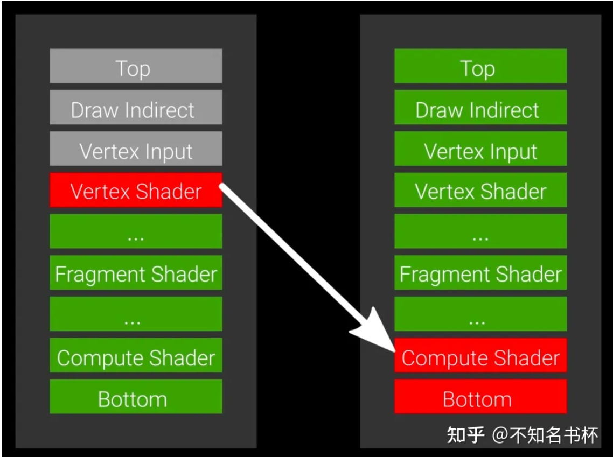

## All I need is here [Yet another blog explaining Vulkan synchronization – Maister's Graphics Adventures (themaister.net)](https://themaister.net/blog/2019/08/14/yet-another-blog-explaining-vulkan-synchronization/)

### Availability and Visibility

The largest difference between the C++ memory model and that of Vulkan/SPIR-V is the inclusion of availability and visibility operations.

Availability operations ensure that values written to a memory location in one thread can be made **available** to *other threads*. Visibility operations guarantee that values which are **available** are made **visible** to a thread, to *ensure that the correct values are read*. For typical devices supporting Vulkan, availability and visibility operations will map to cache control (e.g. flushes/invalidates/bypass).

-- [Khronos Blog - The Khronos Group Inc](https://www.khronos.org/blog/comparing-the-vulkan-spir-v-memory-model-to-cs)

## 为什么需要同步

### 执行模型差异

### 内存模型差异

- 传统API 开发者不能直接分配或管理GPU端资源的内存；CPU和GPU之间同步资源是有代价的

- 传统API： ~~逻辑资源与物理内存紧密结合，这使得framebuffer 的attachment只能用于一帧内； vulkan将资源的概念 image，buffer与支持的物理内存分开，使得在渲染过程中的不同时间节点上为多个不同的资源重复使用相同的物理内存成为可能~~

  

### Command 和 Pipeline stage

所有Command的功能可以分为：

- Perform Actions

- Set State

- Perform Synchronizations

  | Action            | Set State                      | Synchronization         |
  | ----------------- | ------------------------------ | ----------------------- |
  | Draw              | Bind Pipeline                  | Set/Wait Events         |
  | Dispatch          | Bind Descriptor Sets           | Pipeline Barrier        |
  | Clear             | Bind Buffers                   | Render Pass Dependencis |
  | Copy              | Set Dynamic State              | Sub Pass Dependencis    |
  | Query/Timestamp   | *Push Constants                |                         |
  | Begin/End Subpass | Set Render Pass/Sub Pass State |                         |

Action Command会包含多个Operation(对应 pipeline state)。

同步Command通过同步作用域(synchronization scopes)为两组Operation之间引入了内存依赖和执行依赖(后面会讲到). 任何不在同步Command的同步作用域中的Operation类型都不会被包括在所产生的依赖关系中。通过同步Command对于Operation的控制，那么同步Command就能够在在两组Action Command之间引入了明确的执行和内存依赖关系。

### Pipeline Stage

**现代 API 的同步就主要发生在这些 Pipeline Stage 中。**

每种类型的 Command Queue 分别对应不同的 Pipeline Stage，对应关系如下：

Graphics Queue

- Indirect Draw
- Vertex Input
- ***Vertex Shader***
- ***Tessellation Control Shader\***
- ***Tessellation Evalution Shader\***
- ***Geometry Shader\***
- ***Fragment Shader\***
- Color Attachment Output

Compute Queue

- Indirect Draw
- ***Compute Shader\***

Transfer Queue

- Transfer

会执行的哪些Pipeline Stage取决于所使用的特定Command以及Record Command时的当前Command Buffer状态。而且针对不同的Command还会有这一些特定的Pipeline Stage，有些同步Command会包含Pipeline Stage参数将该Command的同步范围限制在这些Pipeline Stage内

有些Pipeline Stage可以合并，有些Pipeline Stage可以缺失，但总的来说这些是一个渲染Command要经过的Pipeline Stage。简单来说Pipeline Stage为同步Command提供了更细粒度的支持。后面说到各种不同的同步原语以及Pipeline Barrier会着重讲到。

下面是使用Pipeline Stage来设置执行依赖的例子，在同步Command中设置同步作用域分别为VERTEX_SHADER_BIT和COMPUTE_SHADER_BIT。然后同步Command塞入在两组Action Command(比如两个Draw相关的命令)之间。能够保证的执行依赖如下所示：

### 